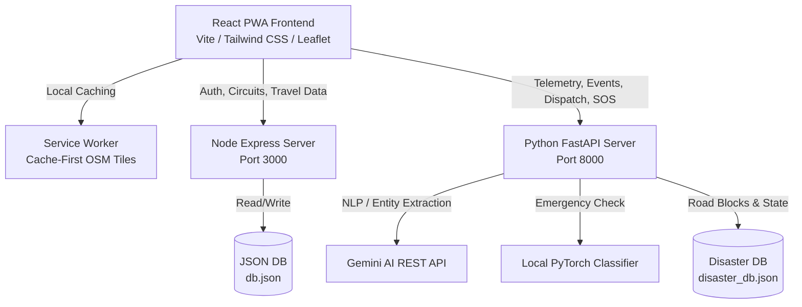

# Mangalore.Nav — Kudla Travel Planner & Tactical Command Center (A.G.I.S.)

Welcome to **Mangalore.Nav** (Kudla Travel Planner), a next-generation geolocated Progressive Web App (PWA) built for the Mangaluru & Udupi coastal region. 

The application serves a dual purpose:
1. **Mangalore.Nav — Kudla Travel Planner**: A comprehensive explorer tool featuring accounts, custom itinerary building, food guides, culture highlights, hidden gems, rentals, and offline-capable maps.
2. **A.G.I.S. (Autonomous Guardian Intelligence System) Tactical Command Center**: A real-time, AI-driven disaster relief dashboard that monitors social media feeds, runs PyTorch classifications on emergencies, extracts entities via Gemini AI, manages rescue camp resources, dynamically calculates risk-aware routes around road blockages, and streams telemetry via WebSockets.

---

## 🗺️ Architectural Overview

The application is structured as a decoupled ecosystem featuring a React single-page frontend and two backend servers:



### 1. The Frontend (Vite + React)
- **Interactive Leaflet Mapping**: Renders custom OpenStreetMap tiles with overlay support.
- **PWA Service Worker**: Intercepts requests to cache static assets and map tiles, allowing the application to load and function in low-connectivity zones.
- **Real-Time Data Streams**: Leverages WebSockets for live status updates of dispatched vehicles.

### 2. Node/Express Backend (`server.js` - Port 3000)
- **User Authentication**: Secure signup/login with password hashing (`bcryptjs`).
- **Data Persistence**: Backed by `db.json` storing user configurations, favorite destinations, and travel history.
- **Bypass Proxies**: Proxies Nominatim and OpenStreetMap routing commands to circumvent browser CORS restrictions and localhost rate limits.

### 3. Python FastAPI Backend (`backend/main.py` - Port 8000)
- **WebSocket Telemetry Engine**: Computes and broadcasts vehicle positions along route polylines in real time.
- **A.G.I.S. Emergency Classifier**:
  - **PyTorch Binary Neural Net**: Analyzes text feeds locally to differentiate noise from legitimate emergencies.
  - **Gemini NLP Extractor**: Extracts emergency parameters (disaster type, casualty count, urgency level) using Gemini REST protocols.
- **Geocoding Core**: Operates a 3-tier fallback engine (Local Fuzzy Matching $\rightarrow$ Nominatim API $\rightarrow$ Incident Centroid Density).
- **Risk-Aware Pathfinder**: Automatically updates routing itineraries to navigate around user-defined road blockages or waterlogged sectors.

---

## ✨ Features

### 📡 A.G.I.S. Tactical Command Center
- **Live Operation Map**: Track the real-time status, speed, and inventory of rescue boats, ambulances, supply trucks, and helicopters.
- **Dynamic Blocked Roads**: Click on the map to add custom circular hazards (e.g., waterlogging, landslides). Routes will immediately recalculate to steer vehicles clear of threat zones.
- **Simulation Event Panel**: Trigger mock natural disasters (Cyclone, Cloudburst, Landslide, Evacuation Alert) to see how the system auto-adjusts telemetry and resources.
- **Resource Management Dashboard**: View available dry food, fresh water, and medical kits across multiple rescue camps (Camp Alpha, Camp Beta, Coastal Rescue Unit).

### 🤖 AI-Powered Emergency NLP
- **Social Media Monitor**: Ingests incoming tweets, posts, or manual SOS alerts.
- **Machine Learning Classification**: A custom neural network trained on local Mangaluru/Kudla coordinates filters out general queries and highlights high-urgency rescue calls.
- **LLM Metadata Structuring**: Converts raw text into JSON schema representing:
  - **Emergency Category**: `Rescue`, `Medical`, `Food/Water`, or `Hazard`.
  - **Affected Victim Count**: Dynamic integers.
  - **Urgency Rating**: Rated 1 through 10.
  - **Location Georeferencing**: Converts local areas (e.g., Hampankatta, Jyothi Circle) into precise latitude/longitude vectors.

### 📶 PWA, Offline Modes & Syncing
- **Service Worker (`sw.js`)**: Automatically caches static assets (`assets/`, `/images/*`) and map tiles from OpenStreetMap.
- **Offline Mode Indicator**: Renders a glassmorphic connection overlay when telemetry links drop, utilizing browser local storage to maintain system state.
- **Background Database Sync**: Monitors network status. Local queue modifications are automatically uploaded to the server once the connection is restored.

---

## 📂 Project Structure

```text
├── backend/
│   ├── __init__.py
│   ├── main.py            # FastAPI entry point & WS routing server
│   ├── nlp_engine.py      # PyTorch classifier & Gemini REST extraction
│   └── risk_routing.py    # Geocoding fallback, Haversine math & path avoidances
├── public/
│   ├── manifest.json      # PWA Configuration Metadata
│   └── sw.js              # Service Worker (OSM tile caching & client routing)
├── src/
│   ├── components/        # ChatAssistant, MapComponent, RouteBuilder, etc.
│   ├── pages/             # TacticalCommandCenter, LandingPage, AccountPage, etc.
│   ├── App.jsx            # Telemetry link listener & routing layout
│   └── main.jsx           # Service worker initiator & Sync listener
├── server.js              # Express API (Auth, OTP, saved circuits & local db)
├── db.json                # Express server JSON database
├── disaster_db.json       # FastAPI database seeds
├── package.json           # Frontend and node environment scripts
└── .env                   # API keys configuration
```

---

## 🚀 Installation & Setup

### Prerequisites
- **Node.js**: Version 18 or above.
- **Python**: Version 3.9 or above (Pip installed).
- **Gemini API Key**: Required for Gemini AI features.

### Step 1: Clone and Configure Environment Variables
Create a `.env` file in the root directory and add your Gemini API Key:
```env
VITE_GEMINI_API_KEY=YOUR_GEMINI_API_KEY_HERE
GEMINI_API_KEY=YOUR_GEMINI_API_KEY_HERE
```

### Step 2: Install Node Dependencies
Install frontend and Express dependencies in the root directory:
```bash
npm install
```

### Step 3: Set Up Python Virtual Environment & Install Packages
Set up a Python virtual environment and install PyTorch, FastAPI, Uvicorn, and standard libraries:

**On Windows (Command Prompt/PowerShell):**
```powershell
python -m venv venv
.\venv\Scripts\activate
pip install torch fastapi uvicorn requests pydantic
```

**On macOS/Linux:**
```bash
python3 -m venv venv
source venv/bin/activate
pip install torch fastapi uvicorn requests pydantic
```

---

## 🖥️ Running the Application

To run the complete system, you must start the two backend servers followed by the frontend client. Open three separate terminal sessions:

### Session 1: Express Server (Port 3000)
```bash
node server.js
```
*Note: A default administrator account `admin_ajith@gmail.com` with password `1234` will be automatically seeded in `db.json`.*

### Session 2: FastAPI Python Backend (Port 8000)
```bash
# Ensure your python virtual environment is activated
npm run backend
```
*Alternative command: `uvicorn backend.main:app --host 127.0.0.1 --port 8000 --reload`*

### Session 3: Vite React Client (Port 5173)
```bash
npm run dev
```

The terminal will provide a local address (typically `http://localhost:5173`). Open this URL in your web browser.

---

## 🛠️ Verification & Testing

1. **Verify Connections**: Once loaded, a green toast indicating **"TELEMETRY LINK ACTIVE"** should confirm a successful handshake between your React client and the FastAPI backend.
2. **Simulate a Crisis**: Open the right sidebar panel, click **Simulate Cloudburst**, and observe the weather metrics change, while random SOS alerts pop up on the map.
3. **Dispatch a Vehicle**: Click **Manual Dispatch**, pick an emergency call, load food or medical kits, and click **Initiate Dispatch**. Watch the vehicle follow the route on the map in real time.
4. **Test Offline Fallback**: In Chrome DevTools, navigate to the **Application** tab, confirm the service worker is active, toggle **Offline** in the Network panel, and refresh. The application will continue to load and simulate routing locally.
